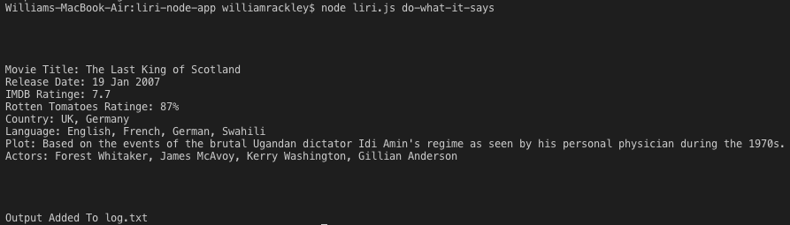
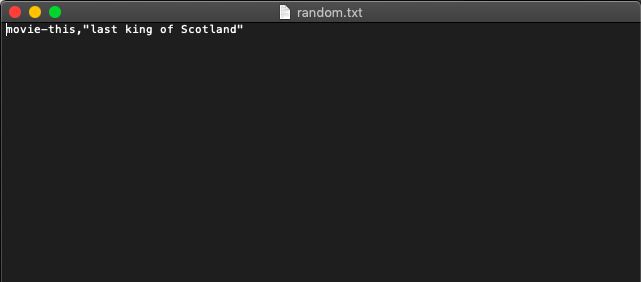
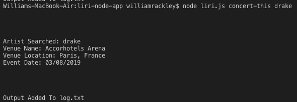
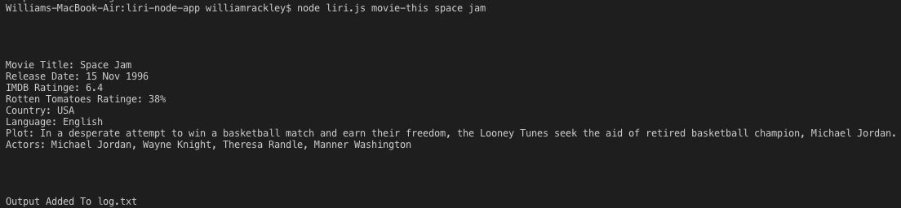
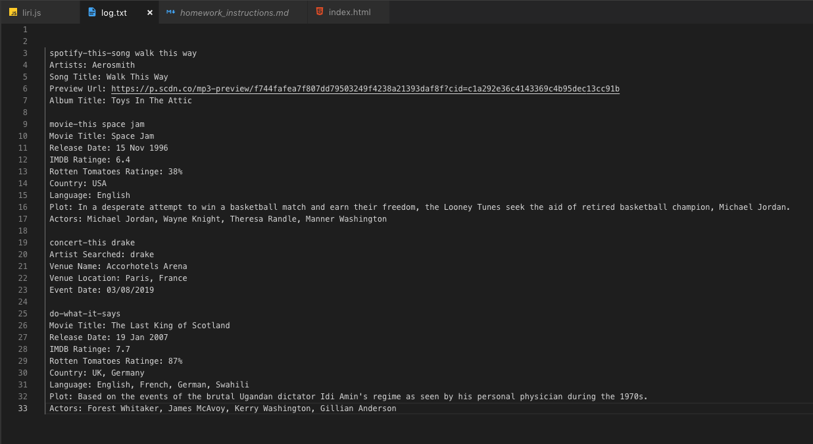

# liri-node-app
The Liri Node App is a command line node app that takes in parameters and gives you back data. This app searches Spotify for songs,Bands in Town for concerts, and OMDB for movies. The app also reads text from a file (random.txt)to run commands and pushes user output to a log.text file.

## How It Works
In the command line, the user types in one of 4 commands: do-what-it-says, concert-this, movie-this, or spotify-this-song. All the commands other than the 'do-what-it-says' command are able to take in another command following the concert-this, movie-this, or spotify-this-song command, where the user can search the name of a song, movie, or band/artist. Each command is explained in detail below.

## CLI Screenshoots
[link to liri app screenshots and video demo!](https://willrackley.github.io/liri-node-app/)

## do-what-it-says
 

The user types in 'do-what-it-says' and the liri.js file reads the random.text file and runs that in the command line.

## concert-this
 

The user types in 'concert-this' and the name of a band/artist and liri.js takes that information and makes a call to the bands in town api. The output displays the name of the venue, venue location, and date of the event.

## movie-this
 

The user types in 'movie-this' and the name of a movie. Liri.js takes that information and makes a call to the omdb api. The output displays the title of the movie, year, imdb rating, rotten tomatoes rating, country where it was produces, language of the movie, plot, and the actors in the movie. 

## spotify-this-song

The user types in 'spotify-this-song' and the name of a song. Liri.js takes that information and makes a call to the spotify api. The output displays the artist name, song name, preview link (if availabe), and the album that the song is from. If the user does not initially specify a song, then 'The Sign' by Ace of Spades is displayed.

## log.txt file

Once the user inputs the info that they are looking for, that output is then appended to a 'log.txt' file.
In this case, the user utilized all of the commands.

